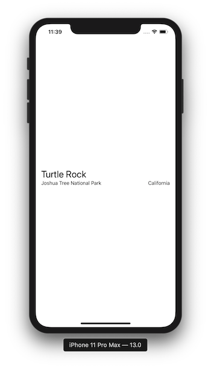
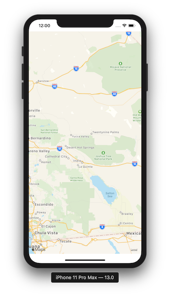
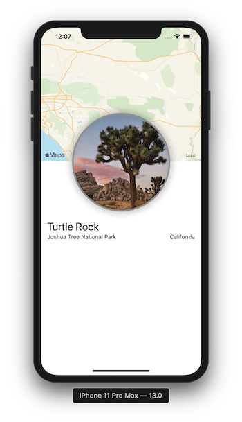
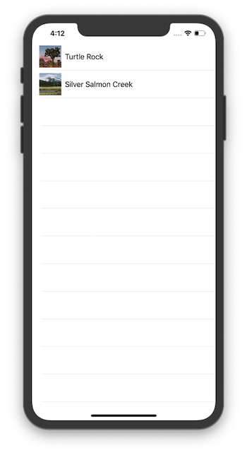
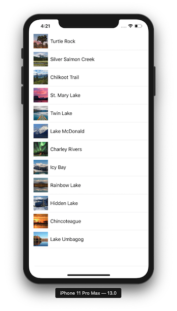
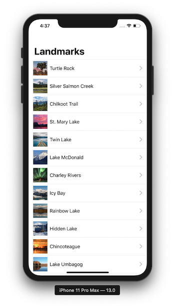
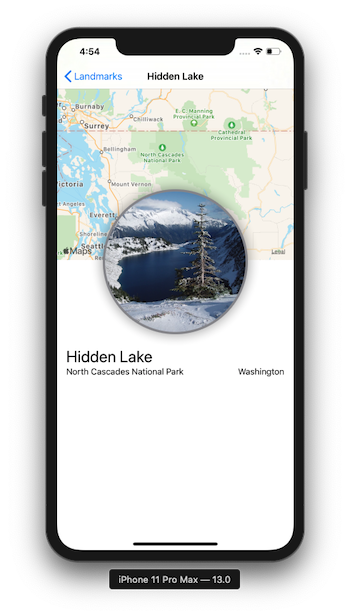
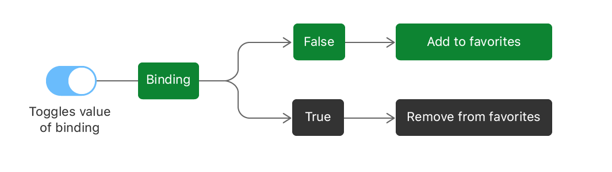

# SwiftUI Essentials

By default, a SwiftUI file declares two structures. One that conforms to the View protocol and describes the view content and layout. The second declares a preview for that view. 

```swift
import SwiftUI

struct ContentView: View {
    var body: some View {
        Text("Hello World")
    }
}

struct ContentView_Previews: PreviewProvider {
    static var previews: some View {
        ContentView()
    }
}

```

To customize a SwiftUI view you call methods called **modifiers**. This methods return a new view so it's common to chain multiple modifiers. 

When you create a SwiftUI view you modify its **content**, **layout**, and **behavior** in the view's body property. The **body** property only returns a single view, therefore, we can use StackViews to build more complex views. 

```swift
struct ContentView: View {
    var body: some View {
        VStack(alignment: .leading) {
            Text("Turtle Rock")
                .font(.title)
            HStack {
                Text("Joshua Tree National Park")
                    .font(.subheadline)
                Spacer()
                Text("California")
                .font(.subheadline)
            }
        }
        .padding()
    }
}
```

A **spacer** expands its containing view to use all of the size of its parent view. 

**Padding** gives the edges (leading and trailing) a little seperation from the Safe Area's edges. 



---

### Create a Custom Image View 

File > New > File > SwiftUI View > CircleImage.swift

```swift
struct CircleImage: View {
    var body: some View {
        Image("turtlerock")
            .clipShape(Circle())
            .overlay(Circle().stroke(Color.gray, lineWidth: 4))
            .shadow(radius: 10)
    }
}
```


---

### Use UIKit and SwiftUI Views Together 

To use UIView subclasses from within SwiftUI, you wrap the other view in a SwiftUI view that conforms to the **UIViewRepresentable** protocol. 

File > New > File > SwiftUI View > MapView

The **UIViewRepresentable** protocol has two requirements: 

1. ```makeUIView(context:)```: method that creates a **MKMapView**
2. ```updateUIView(_:context:)```: method that configures the view and responds to any change

```swift
import SwiftUI
import MapKit

struct MapView: UIViewRepresentable {
    
    func makeUIView(context: Context) -> MKMapView {
        MKMapView(frame: .zero)
    }
    
    func updateUIView(_ view: MKMapView, context: Context) {
        let coordinate = CLLocationCoordinate2D(latitude: 34.011286, longitude: -116.166868)
        let span = MKCoordinateSpan(latitudeDelta: 2.0, longitudeDelta: 2.0)
        let region = MKCoordinateRegion(center: coordinate, span: span)
        view.setRegion(region, animated: true)
    }

}

struct MapView_Previews: PreviewProvider {
    static var previews: some View {
        MapView()
    }
}

```



---

### Compose the Detail View

```swift
var body: some View {
        VStack {
            MapView()
                .edgesIgnoringSafeArea(.top)
                .frame(height: 300)
            CircleImage()
                .offset(y: -130)
                .padding(.bottom, -130)
            VStack(alignment: .leading) {
                Text("Turtle Rock")
                    .font(.title)
                HStack {
                    Text("Joshua Tree National Park")
                        .font(.subheadline)
                    Spacer()
                    Text("California")
                    .font(.subheadline)
                }
            }
            .padding()
            Spacer()
        }
    }
```



## Building Lists and Navigation

The first step in building a list is the row: 

```swift
struct LandmarkRow: View {
    var landmark: Landmark
    var body: some View {
        HStack {
            landmark.image
                .resizable()
                .frame(width: 50, height: 50)
            Text(landmark.name)
        }
    }
}
```

You can use a **Group** to return mutliple previews from a preview provider. **Group** is a container grouping view content. 

```swift
Group {
            LandmarkRow(landmark: landmarkData[0])
            LandmarkRow(landmark: landmarkData[1])
}
        .previewLayout(.fixed(width: 300, height: 70))
```

Now, once we have our custom row, we can use **SwiftUI's List** type. The elements of the list can be static, like the child views of the stacks, or dynamically generated. You can even mix static and dynamically generated views. 

File > New > File > SwiftUI View > **LandmarkList.swift**

```swift
struct LandmarkList: View {
    var body: some View {
        List {
            LandmarkRow(landmark: landmarkData[0])
            LandmarkRow(landmark: landmarkData[1])
        }
    }
}

```



### Making the list dynamic

You can generate rows directly from a collection. You can create a list that displays the elements of collection of data and a closure that provides a view for each element in the collection. The list transforms each element in the collection into a child view by using the supplied closure.  


**Lists** work with identifiable data. You can make your data identifiable in one of the two ways: 

1. By passing along with your data a key path to a property that uniquely identifies each element
2. By making your data type conform the Identifiable protocol. 

```swift
struct LandmarkList: View {
    var body: some View {
        List(landmarkData, id: \.id) { landmark in
            LandmarkRow(landmark: landmark)
        }
    }
}
```



Now, simplifying the previous code by conforming to de **Identifiable** protocol: 

(When conforming to the **Identifiable** protocol your struct or class should have the ```id```  property)

```swift
struct Landmark: Hashable, Codable, Identifiable {
    var id: Int
    var name: String
    fileprivate var imageName: String
    fileprivate var coordinates: Coordinates
    var state: String
    var park: String
    var category: Category

    var locationCoordinate: CLLocationCoordinate2D {
        CLLocationCoordinate2D(
            latitude: coordinates.latitude,
            longitude: coordinates.longitude)
    }

    enum Category: String, CaseIterable, Codable, Hashable {
        case featured = "Featured"
        case lakes = "Lakes"
        case rivers = "Rivers"
    }
}
```

Now we can remove the **id** parameter: 

```swift
struct LandmarkList: View {
    var body: some View {
        List(landmarkData) { landmark in
            LandmarkRow(landmark: landmark)
        }
    }
}
```


### Set Up Navigation Between List and Detail

In order to add navigation capabilities to a list, you embed the list in a NavigationView, and then nesting each row in a NavigationLink to set up a transition to a destination view. 

```swift
struct LandmarkList: View {
    var body: some View {
        NavigationView {
            List(landmarkData) { landmark in
                NavigationLink(destination: LandmarkDetail()) {
                    LandmarkRow(landmark: landmark)
                }
            }
        .navigationBarTitle(Text("Landmarks"))
        }
    }
}
```



## Pass Data into Child Views

A common pattern when building views using SwiftUI is that your custom views will often wrap and encapsulate a series of modifiers for a particular view.

```swift
struct LandmarkDetail: View {
    var landmark: Landmark
    var body: some View {
        VStack {
            MapView(coordinate: landmark.locationCoordinate)
                .edgesIgnoringSafeArea(.top)
                .frame(height: 300)
            CircleImage(image: landmark.image)
                .offset(y:-130)
                .padding(.bottom, -130)
            VStack(alignment: .leading) {
                Text(landmark.name)
                    .font(.title)
                HStack {
                    Text(landmark.park)
                        .font(.subheadline)
                    Spacer()
                    Text(landmark.state)
                        .font(.subheadline)
                }
            }
                .padding()
            Spacer()
        }
        .navigationBarTitle(Text(landmark.name), displayMode: .inline)
    }
}

```



## Handling User Input

Adding a star to each row depending if the ```landmark``` 's ```isFavorite``` property is set to **true**. 

```swift
struct Landmark: Hashable, Codable, Identifiable {
    var id: Int
    var name: String
    fileprivate var imageName: String
    fileprivate var coordinates: Coordinates
    var state: String
    var park: String
    var category: Category
    var isFavorite: Bool //first, add the isFavorite property

    var locationCoordinate: CLLocationCoordinate2D {
        CLLocationCoordinate2D(
            latitude: coordinates.latitude,
            longitude: coordinates.longitude)
    }

    enum Category: String, CaseIterable, Codable, Hashable {
        case featured = "Featured"
        case lakes = "Lakes"
        case rivers = "Rivers"
        case mountains = "Mountains"
    }
}
```

```swift
struct LandmarkRow: View {
    var landmark: Landmark
    var body: some View {
        HStack {
            landmark.image
                .resizable()
                .frame(width: 50, height: 50)
            Text(landmark.name)
            Spacer()
            
            if landmark.isFavorite {
                Image(systemName: "star.fill")
                    .imageScale(.medium)
                    .foregroundColor(.yellow)
            }
        }
    }
}
```

#### Filter the List View

You can customize the list view so that it shows all of the landmarks, or just the user's favorites. To do this, you'll need to add a bit of **state** to the **LandmarkList** type. 

**State** is a value, or a set of values, that can change over time, that affects a view's behavior, content, or layout. You use a property with the ```@State``` attribute to add state to a view. 

***State is a persistent value of a given type, through which a view reads and monitors the value.***

```swift
struct LandmarkList: View {
    @State var showFavoritesOnly = false
    var body: some View {
        NavigationView {
            List(landmarkData) { landmark in
                if !self.showFavoritesOnly || landmark.isFavorite {
                    NavigationLink(destination: LandmarkDetail(landmark: landmark)) {
                        LandmarkRow(landmark: landmark)
                    }
                }
            }
            .navigationBarTitle(Text("Landmarks"), displayMode: .large)
        }
    }
}
```

### Add a Control to Toggle the State

A binding acts as a reference to a mutable state. When a user taps the toggle from off to on, and off again, the control uses the binding to update the view's state accordingly. 

To combine static and dynamic views in a list, or to combine groups of dynamic views, use the ForEach type instead of passing your collection of data to **List**. 

```swift
struct LandmarkList: View {
    @State var showFavoritesOnly = false
    var body: some View {
        NavigationView {
            List {
                ForEach(landmarkData) { landmark in
                    if !self.showFavoritesOnly || landmark.isFavorite {
                        NavigationLink(destination: LandmarkDetail(landmark: landmark)) {
                            LandmarkRow(landmark: landmark)
                        }
                    }
                }
            }
            .navigationBarTitle(Text("Landmarks"), displayMode: .large)
        }
    }
}
```

Next, add a **Toggle** view as the first child of the **List** view, passing a binding to ```show FavoritesOnly```. You use the **$ prefix** **to access a binding to a *state* variable**, or one of its properties. 

```swift
struct LandmarkList: View {
    @State var showFavoritesOnly = false
    var body: some View {
        NavigationView {
            List {
                
                Toggle(isOn: $showFavoritesOnly) {
                    Text("Favorites only")
                }
                
                ForEach(landmarkData) { landmark in
                    if !self.showFavoritesOnly || landmark.isFavorite {
                        NavigationLink(destination: LandmarkDetail(landmark: landmark)) {
                            LandmarkRow(landmark: landmark)
                        }
                    }
                }
            }
            .navigationBarTitle(Text("Landmarks"), displayMode: .large)
        }
    }
}
```


### Use and Observable Object for Storage

To prepare for the user control which particular landmarks are favorites, you'll first store the landmark data in an **observable** object. An ***observable object*** *is a custom object for your data that can be bound to a view from storage in SwiftUI's environment*. SwiftUI watches for any changes to observable objects that could affect a view, and displays the correct version of the view after a change. 

SwiftUI subscribes to your observable object, and updates any views that need refreshing when the data changes. An observable object needs to publish any changes to its data, so that it's subscribers can pick up the change, therefore add the **@Published** attribute to each property. 

```swift
import Foundation
import Combine

final class UserData: ObservableObject {
    @Published var showFavoritesOnly = false
    @Published var landmarks = landmarkData
}

```

### Adopt the Model Object in Your Views 

The ```userData``` property gets its value automatically, as long as the environment **Object** modifier has been applied to a parent. 

```swift
struct LandmarkList: View {
//    @State var showFavoritesOnly = false
    @EnvironmentObject var userData: UserData    
  
    var body: some View {
        NavigationView {
            List {
                
                Toggle(isOn: $userData.showFavoritesOnly) {
                    Text("Favorites only")
                }
                
                ForEach(userData.landmarks) { landmark in
                    if !self.userData.showFavoritesOnly || landmark.isFavorite {
                        NavigationLink(destination: LandmarkDetail(landmark: landmark)) {
                            LandmarkRow(landmark: landmark)
                        }
                    }
                }
            }
            .navigationBarTitle(Text("Landmarks"), displayMode: .large)
        }
    }
}
```




```swift
struct LandmarkDetail: View {
    @EnvironmentObject var userData: UserData
    var landmark: Landmark
    
    var landmarkIndex: Int {
        userData.landmarks.firstIndex {
            $0.id == landmark.id
        }!
    }
    
    var body: some View {
        VStack {
            MapView(coordinate: landmark.locationCoordinate)
                .edgesIgnoringSafeArea(.top)
                .frame(height: 300)
            CircleImage(image: landmark.image)
                .offset(y:-130)
                .padding(.bottom, -130)
            VStack(alignment: .leading) {
                HStack {
                    Text(landmark.name)
                        .font(.title)
                    
                    Button(action: {
                        self.userData.landmarks[self.landmarkIndex].isFavorite.toggle()
                    }) {
                        if self.userData.landmarks[self.landmarkIndex].isFavorite {
                            Image(systemName: "star.fill")
                                .foregroundColor(Color.yellow)
                        }else {
                            Image(systemName: "star")
                                .foregroundColor(Color.gray)
                        }
                    }
                    
                }
                HStack {
                    Text(landmark.park)
                        .font(.subheadline)
                    Spacer()
                    Text(landmark.state)
                        .font(.subheadline)
                }
            }
                .padding()
            Spacer()
        }
        .navigationBarTitle(Text(landmark.name), displayMode: .inline)
    }
}
```


