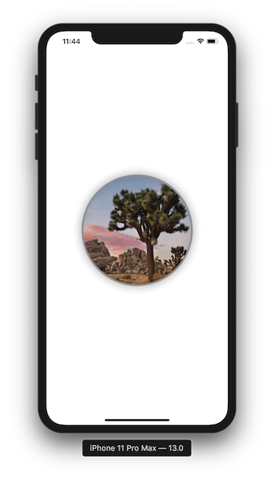

# SwiftUI Essentials

By default, a SwiftUI file declares two structures. One that conforms to the View protocol and describes the view content and layour. The second declares a preview for that view. 

```swift
import SwiftUI

struct ContentView: View {
    var body: some View {
        Text("Hello World")
    }
}

struct ContentView_Previews: PreviewProvider {
    static var previews: some View {
        ContentView()
    }
}

```

To customize a SwiftUI view you call methods called **modifiers**. This methods return a new view so it's common to chain multiple modifiers. 

When you create a SwiftUI view you modify its **content**, **layout**, and **behavior** in the view's body property. The **body** property only returns a single view, therefore, we can use StackViews to build more complex views. 

```swift
struct ContentView: View {
    var body: some View {
        VStack(alignment: .leading) {
            Text("Turtle Rock")
                .font(.title)
            HStack {
                Text("Joshua Tree National Park")
                    .font(.subheadline)
                Spacer()
                Text("California")
                .font(.subheadline)
            }
        }
        .padding()
    }
}
```

A **spacer** expants its containing view to use all of the size of its parent view. 

**Padding** gives the edges (leading and trailing) a little seperation from the Safe Area's edges. 


---

### Create a Custom Image View 

File > New > File > SwiftUI View > CircleImage.swift

```swift
struct CircleImage: View {
    var body: some View {
        Image("turtlerock")
            .clipShape(Circle())
            .overlay(Circle().stroke(Color.gray, lineWidth: 4))
            .shadow(radius: 10)
    }
}
```



---

### Use UIKit and SwiftUI Views Together 

To use UIView subclasses from within SwiftUI, you wrap the other view in a SwiftUI view that conforms to the **UIViewRepresentable** protocol. 

File > New > File > SwiftUI View > MapView

The **UIViewRepresentable** protocol has two requirements: 

1. ```makeUIView(context:)```: method that creates a **MKMapView**
2. ```updateUIView(_:context:)```: method that configures the view and responds to any change

```swift
import SwiftUI
import MapKit

struct MapView: UIViewRepresentable {
    
    func makeUIView(context: Context) -> MKMapView {
        MKMapView(frame: .zero)
    }
    
    func updateUIView(_ view: MKMapView, context: Context) {
        let coordinate = CLLocationCoordinate2D(latitude: 34.011286, longitude: -116.166868)
        let span = MKCoordinateSpan(latitudeDelta: 2.0, longitudeDelta: 2.0)
        let region = MKCoordinateRegion(center: coordinate, span: span)
        view.setRegion(region, animated: true)
    }

}

struct MapView_Previews: PreviewProvider {
    static var previews: some View {
        MapView()
    }
}

```


---

### Compose the Detail View

```swift
var body: some View {
        VStack {
            MapView()
                .edgesIgnoringSafeArea(.top)
                .frame(height: 300)
            CircleImage()
                .offset(y: -130)
                .padding(.bottom, -130)
            VStack(alignment: .leading) {
                Text("Turtle Rock")
                    .font(.title)
                HStack {
                    Text("Joshua Tree National Park")
                        .font(.subheadline)
                    Spacer()
                    Text("California")
                    .font(.subheadline)
                }
            }
            .padding()
            Spacer()
        }
    }
```


